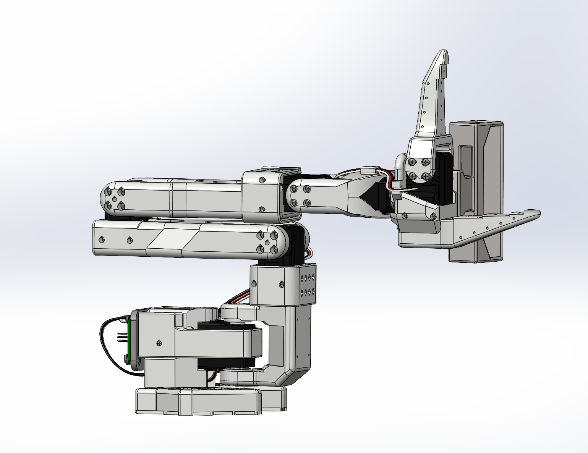
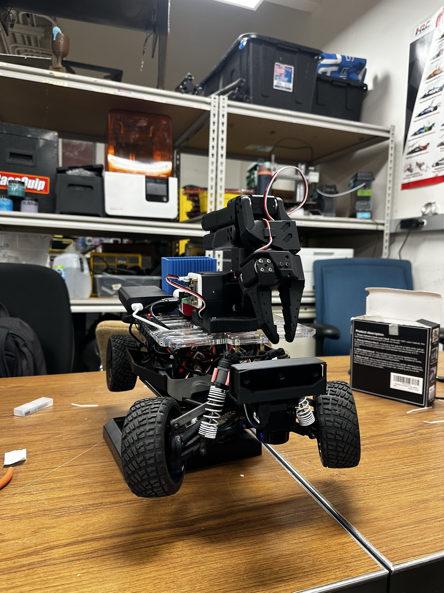

# Autonomous Trash Collection

### Team 10 & 15
### ECE/MAE 148 Final Project Winter 2026

---

## Table of Contents
1. [Team Members](#team-members)
2. [Overview](#overview)
3. [What We Promised](#what-we-promised)
4. [Accomplishments](#accomplishments)
5. [Demonstration](#demonstration)
6. [Challenges](#challenges)
7. [Project Design](#robot-arm-design)
8. [References](#references)
9. [Acknowledgments](#acknowledgments)

---

## Team Members
Team 15
- David Carrillo - MAE
- Darin Djapri 
- Lek Man- MAE
- Ryan Chen- ECE

Team 10
- Marcus Greenan - MAE
- Giovanni Clark - ECE
- Harihar Kaushik - ECE
- Lucas Johnson - ECE

---

## Overview
The **Autonomous Trash Collection** robot is a self-driving car equipped with a robotic arm that searches for and picks up litter. Using computer vision, the robot identifies trash on the ground, navigates toward it autonomously, and uses the robotic arm to collect and place it in the bin. The robot can then deliver the trash to a designated dropoff location.

---

## What We Promised

### Must Have:
- Autonomous driving and navigation
- Computer vision-based trash detection using OAK-D camera
- Robotic arm that picks up detected trash
- Deposits collected trash into an onboard bin
- Stop and approach detected trash accurately

### Nice to Have:
- Multiple trash detection and collection in a single run
- Sorting trash by type (recyclable vs. non-recyclable)
- Return to base behavior after bin is full

---

## Accomplishments
- Successfully integrated OAK-D camera with YOLOv8 model for real-time trash detection (~85% accuracy)
- Developed a ROS2 package to calculate the angle and distance from the camera to detected trash
- 3D printed a robotic arm mount for the car chassis
- Programmed the robotic arm to execute pick and place sequences upon trash detection, and integrated this functionality into a ROS2 node
- Developed a ROS2 package to facilitate centroid tracking with PID control to navigate to object
- Put together a ROS2 node based on the existing UCSD node package to identify an object, drive to it, and stop a certain distance away before triggering the arm pick-up package.
- Created a modified version of the UCSD Robocar Docker container incorporating all the aforementioned packages.

---

## Demonstration

[Full Demo Video](https://youtu.be/k4CTWPhfO1g) [Alternate Angle](https://youtu.be/v82C47zf4og)  
[Arm Demo](https://drive.google.com/file/d/1cBP66cU5hcg2m4QuWV22k2muI_fQQhjR/view)  
[Object Detection and Following Demo](https://youtu.be/KGpaVR8SIbE)  
[LiDAR Testing](https://drive.google.com/file/d/15g1UKWkqdbuN8HR0NhmWQhi5QHV1ik_H/view?usp=drivesdk)  

---

## Challenges
- **Arm calibration:** Getting the robotic arm to reliably pick up small/irregular objects required extensive tuning of servo positions and approach angles.
  - Solved by creating a multi-step approach sequence and adding a gripper feedback check.
- **Trash detection accuracy:** The model initially struggled with varying lighting conditions outdoors.
  - Improved the training dataset with augmented images under different lighting conditions, boosting accuracy.
- **Navigation precision:** Stopping at the exact distance needed for the arm to reach the trash was difficult.
  - Used LiDAR distance feedback in combination with camera angle data to fine-tune the stopping position.
- **ROS2 node conflicts:** Running the detection pipeline and arm control simultaneously caused timing conflicts.
  - Resolved by restructuring the node communication pipeline with proper topic queuing.
- **USB Bandwidth Challenges:** USB bandwidth issues stem from the fact that each group of USB 2.0 and USB 3.0 ports on the Raspberry Pi share a bus, and the high refresh rate required for each device in this application. The OAK-D initialization pipeline also switches between USB 2.0 and 3.0 pipelines, adding to port assignment confusion and bandwidth problems.
  -  These issues were partially solved using permanent device ID based assignments to ensure consistency between launches, although these were challenging to make consistent owing to permissions issues between the Docker Container and the host machine. If the permissions are made consistent, device ID based port assignments would be a good solution.
  -  Running inference on the OAK-D Lite camera saves significant bandwidth, since the device only needs to pass results over USB rather than images. Even so, the framerate had to be reduced from the standard 30 FPS to 10 FPS. The same refresh rate modification was applied to the LIDAR.
- **Power Challenges:** Power issues plagued this project. These issues were only partially solved in the interest of longevity, but safe permanent solutions are feasible. Current limiting was a recurring problem with this project, with certain actuator activations triggering brownouts.
  - Partially addressed the problem by simply using mains power to power the arm. However, this could be safely addressed by using a higher rated DC/DC converter. We were unable to source the parts needed in time, and thought it unsafe to splice more wiring to add another DC/DC converter.
  

---

## Robot Arm Design

Arm Calibration Testing

## Object Navigation and Tracking

### Hardware Components List
- SO101 Arm by The Robot Studio 
- OAK-D Camera
- STS3215 Servos
- Motor Control Board
- USB-C Cable

## Car Platform

### Hardware Components List
- Base Driving Platform (Traxxas Chassis with Motor and Steering Servo)
- Flipsky FSESC 6.7 Pro and Antispark Switch Pro with Trampa Servo PDB
- 12V to 12V + 5V DC/DC converter (16A)
- LiPo 4S Battery
- OAK-D Lite Camera 
- LDRobot LDS19 LIDAR
- Raspberry Pi 5 8GB
- Powered USB A 3.0 Hub
- Required Cables

---

## Project Demo

## References
- [TheRobotStudio](https://github.com/TheRobotStudio/SO-ARM100)
- [ECE/MAE148 Documentation](https://docs.google.com/document/d/1VeWe5lWh3oB3GlEVowoPrXruzKi2Am8tP-r6KEEmcX8/edit?tab=t.w2jy0m14qj1#heading=h.7ui7nnadippk)
- [UCSD Robocar Framework](https://gitlab.com/ucsd_robocar2)
- [Luxonis Documentation](https://docs.luxonis.com/hardware/products/OAK-D%20Lite)
- [Trash Detection Dataset - Roboflow](https://universe.roboflow.com)
- [LDRobot LIDAR GitHub](https://github.com/ldrobotSensorTeam)
- [Luxonis Blob Converter](https://blobconverter.luxonis.com/)
- [Label Studio](https://labelstud.io/)

---

## Acknowledgments
Thank you to Professor Jack Silberman and our TAs!

